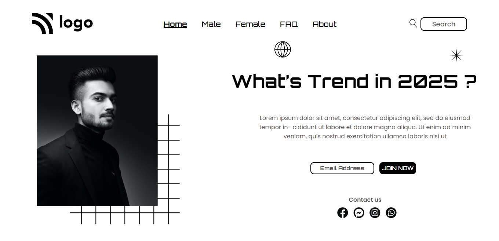

## ⭐Project 01- Street Style Landing Page ⭐

 

## 📌 Live Site URL: <a href="https://streetstylepage.netlify.app" target="_blank">**Visit Now**</a>

 

## 📌 Screenshot:

 

## 📌 What I Learned:

- ### Learned about CSS postion property.
- ### Learned about using of Z-index
- ### Learned about Flexbox

 

## 📌 Time Taken To Complete This Project:

- ### It took me 3 hours to complete this project.

 

## 📌 Social Links:

